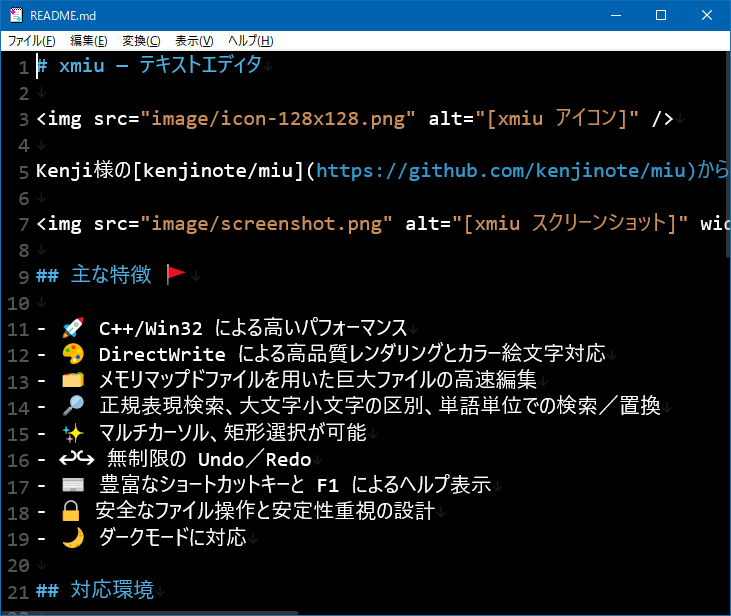

# xmiu — テキストエディタ

xmiu（ペケミウ）は、Kenji様の[kenjinote/miu](https://github.com/kenjinote/miu)からフォークした、普通に使えるテキストエディタです。

## 主な特徴 🚩

- 🎨 カラー絵文字対応
- 🗂 巨大ファイルの高速編集
- 🔎 正規表現検索

## 対応環境

- Windows 11 / Windows 10

## 開発環境

- Visual Studio 2026, Visual Studio 2017

## ダウンロード ⬇

最新リリースは [Releases](https://github.com/katahiromz/xmiu/releases) からダウンロードできます。

## 連絡先 📬

ご意見・ご要望・バグ報告は [Issues](https://github.com/katahiromz/xmiu/issues) または [X/Twitter @katahiromz](https://x.com/katahiromz) までお願いいたします。
